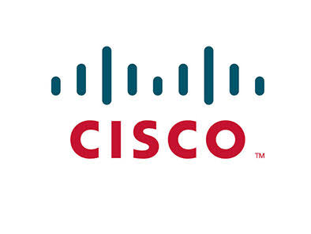

## Tutorial Cisco Packect Tracer

Tutorial konfigurasi, penggunaan pada Cisco Packet Tracer.

## Tutorial
1. [Mode pada CLI](tutor/1/README.md)
2. [Konfigurasi Dasar Router](tutor/2/README.md)
3. [Konfigurasi DHCP](tutor/3/README.md)
4. [Konfigurasi VLAN](tutor/4/README.md)
5. [Jenis Adapter Router](tutor/5/README.md)
6. [Konfigurasi Routing Statis](tutor/6/README.md)
7. [Konfigurasi Routing Dinamis(RIP)](tutor/7/README.md)

