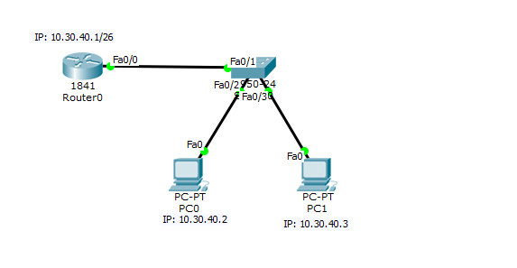
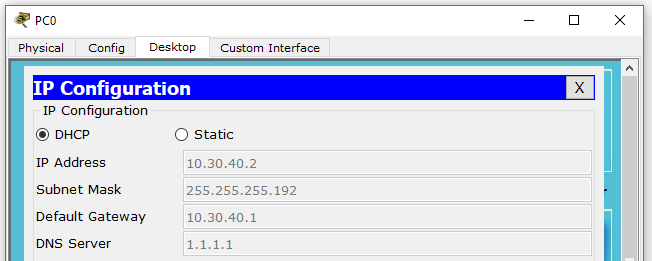
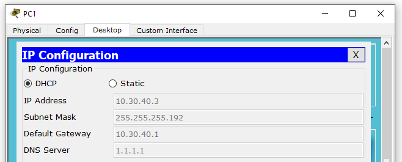
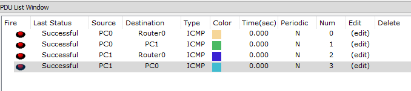

## Konfigurasi DHCP Server

### DHCP
Secara sederhana DHCP adalah sistem untuk konfigurasi protokol, dibagi menjadi 2
**DHCP Server** & **DHCP Client**. Perintah untuk membuat DHCP Server.
```Txt
Router(config)# ip dhcp pool "nama"
Router(dhcp-config)# network "ip_network" "netmask"
Router(dhcp-config)# default-router "ip_gateway"
Router(dhcp-config)# exit
Router(config)#

//IP yang tidak diikutkan
Router(config)# ip dhcp excluded-address "ip"
```
### Topologi Sederhana Untuk DHCP


Pertama kita beri IP pada Router interface FastEthernet0/0.
```Txt
Router>enable
Router#configure terminal
Enter configuration commands, one per line.  End with CNTL/Z.
Router(config)#interface fastEthernet 0/0
Router(config-if)#ip address 10.30.40.1 255.255.255.192
Router(config-if)#no shutdown
%LINK-5-CHANGED: Interface FastEthernet0/0, changed state to up

%LINEPROTO-5-UPDOWN: Line protocol on Interface FastEthernet0/0, changed state to up
Router(config-if)#exit
```
Lalu kita hidupkan layanan DHCP dan buat IP DHCP Pool, lalu masukan IP network, netmask, DNS, Gateway.
```Txt
Router(config)#service dhcp
Router(config)#ip dhcp pool POOL_1
Router(dhcp-config)#network 10.30.40.0 255.255.255.192
Router(dhcp-config)#default-router 10.30.40.1
Router(dhcp-config)#dns-server 1.1.1.1
Router(dhcp-config)#exit
```
Lalu set IP yang tidak diberikan ke klien.
```Txt
Router(config)#ip dhcp excluded-address 10.30.40.1
```
Lalu pada sisi klien (PC 0 dan 1) ganti setingan IP ke DHCP.

#### Setingan IP PC0


#### Setingan IP PC1


Lalu pengujian dari PC0 dan 1 dengan ping.
**PC0 ping Router & PC1**
```Txt
PC>ping 10.30.40.1

Pinging 10.30.40.1 with 32 bytes of data:

Reply from 10.30.40.1: bytes=32 time=1ms TTL=255
Reply from 10.30.40.1: bytes=32 time=0ms TTL=255
Reply from 10.30.40.1: bytes=32 time=0ms TTL=255
Reply from 10.30.40.1: bytes=32 time=0ms TTL=255

Ping statistics for 10.30.40.1:
    Packets: Sent = 4, Received = 4, Lost = 0 (0% loss),
Approximate round trip times in milli-seconds:
    Minimum = 0ms, Maximum = 1ms, Average = 0ms

PC>ping 10.30.40.3

Pinging 10.30.40.3 with 32 bytes of data:

Reply from 10.30.40.3: bytes=32 time=0ms TTL=128
Reply from 10.30.40.3: bytes=32 time=0ms TTL=128
Reply from 10.30.40.3: bytes=32 time=3ms TTL=128
Reply from 10.30.40.3: bytes=32 time=0ms TTL=128

Ping statistics for 10.30.40.3:
    Packets: Sent = 4, Received = 4, Lost = 0 (0% loss),
Approximate round trip times in milli-seconds:
    Minimum = 0ms, Maximum = 3ms, Average = 0ms
```
**PC1 ping Router & PC0**
```Txt
PC>ping 10.30.40.1

Pinging 10.30.40.1 with 32 bytes of data:

Reply from 10.30.40.1: bytes=32 time=1ms TTL=255
Reply from 10.30.40.1: bytes=32 time=0ms TTL=255
Reply from 10.30.40.1: bytes=32 time=0ms TTL=255
Reply from 10.30.40.1: bytes=32 time=1ms TTL=255

Ping statistics for 10.30.40.1:
    Packets: Sent = 4, Received = 4, Lost = 0 (0% loss),
Approximate round trip times in milli-seconds:
    Minimum = 0ms, Maximum = 1ms, Average = 0ms

PC>ping 10.30.40.2

Pinging 10.30.40.2 with 32 bytes of data:

Reply from 10.30.40.2: bytes=32 time=0ms TTL=128
Reply from 10.30.40.2: bytes=32 time=0ms TTL=128
Reply from 10.30.40.2: bytes=32 time=0ms TTL=128
Reply from 10.30.40.2: bytes=32 time=1ms TTL=128

Ping statistics for 10.30.40.2:
    Packets: Sent = 4, Received = 4, Lost = 0 (0% loss),
Approximate round trip times in milli-seconds:
    Minimum = 0ms, Maximum = 1ms, Average = 0ms
```
Lalu untuk pengujian dengan simple PDU.  

