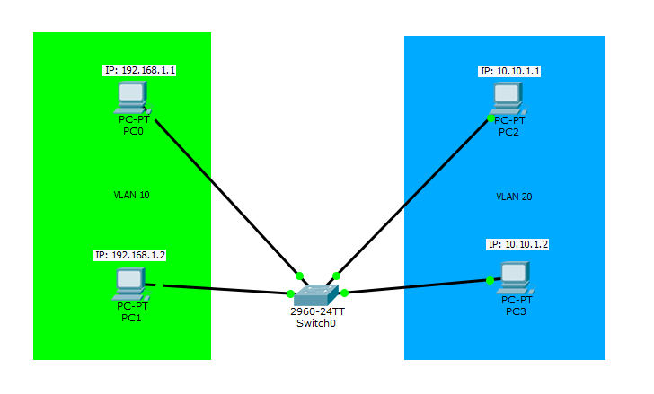
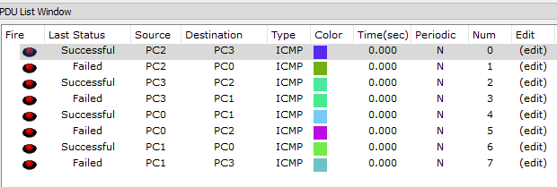

## Konfigurasi VLAN Cisco Packet Tracer

### Pengertian
VLAN atau Virtual Local Area Network adalah LAN yang tidak nyata alias secara virtual. Ini membuat sebuah perangkat berada di jaringan yang berbeda namun masih dalam switch yang sama. 

Semisal pada port nomor 1-5 dengan port 6-10 bisa menggunakan network yang berbeda dan tak bisa saling terhubung walau dalam satu switch, pengelompokan port tersebut bisa di beri sebuah identitas VLAN.

### Cara Kerja
VLAN membagi satu broadcast domain menjadi banyak, sehingga dalam satu buah switch bisa terdiri dari sebagian network.Vlan yaitu fitur yang hanya dimiliki oleh switch mode manageable, contohnya yang cisco miliki yang umum orang menyebutnya “’catalys”.

Pada switch umum atau un-manageable, port hanya bisa dipakai untuk koneksi sesama network dan tidak mendukung fitur VLAN.

### Konfigurasi VLAN Dengan Topologi Sederhana


Lalu berikan IP setiap komputer secara static. Lalu konfigurasi lewat Switch, Switch yang digunakan versi 'catalyst' yang mendukung VLAN.
```Txt
//Melihat VLAN yang sudah ada
Switch#show vlan

VLAN Name                             Status    Ports
---- -------------------------------- --------- -------------------------------
1    default                          active    Fa0/5, Fa0/6, Fa0/7, Fa0/8
                                                Fa0/9, Fa0/10, Fa0/11, Fa0/12
                                                Fa0/13, Fa0/14, Fa0/15, Fa0/16
                                                Fa0/17, Fa0/18, Fa0/19, Fa0/20
                                                Fa0/21, Fa0/22, Fa0/23, Fa0/24
                                                Gig0/1, Gig0/2
1002 fddi-default                     act/unsup 
1003 token-ring-default               act/unsup 
1004 fddinet-default                  act/unsup 
1005 trnet-default                    act/unsup 

VLAN Type  SAID       MTU   Parent RingNo BridgeNo Stp  BrdgMode Trans1 Trans2
---- ----- ---------- ----- ------ ------ -------- ---- -------- ------ ------
1    enet  100001     1500  -      -      -        -    -        0      0
10   enet  100010     1500  -      -      -        -    -        0      0
20   enet  100020     1500  -      -      -        -    -        0      0
1002 fddi  101002     1500  -      -      -        -    -        0      0   
 --More-- 
 ...

Switch#configure terminal 
Enter configuration commands, one per line.  End with CNTL/Z.
//Membuat VLAN no 10
Switch(config)#vlan 10
Switch(config-vlan)#name LAN1
Switch(config-vlan)#ex
Switch(config)#vlan 20
Switch(config-vlan)#name LAN2
Switch(config-vlan)#ex
Switch(config-vlan)#exit 
Switch(config)#ex
Switch(config)#exit 
Switch#
// Melihat VLAN
// Maka ada 2 VLAN baru
// 10  LAN1     active  ...
// 20  LAN2     active  ...
Switch#show vlan

VLAN Name                             Status    Ports
---- -------------------------------- --------- -------------------------------
1    default                          active    Fa0/5, Fa0/6, Fa0/7, Fa0/8
                                                Fa0/9, Fa0/10, Fa0/11, Fa0/12
                                                Fa0/13, Fa0/14, Fa0/15, Fa0/16
                                                Fa0/17, Fa0/18, Fa0/19, Fa0/20
                                                Fa0/21, Fa0/22, Fa0/23, Fa0/24
                                                Gig0/1, Gig0/2
10   LAN1                             active    Fa0/1, Fa0/2
20   LAN2                             active    Fa0/3, Fa0/4
1002 fddi-default                     act/unsup 
1003 token-ring-default               act/unsup 
1004 fddinet-default                  act/unsup 
1005 trnet-default                    act/unsup 

VLAN Type  SAID       MTU   Parent RingNo BridgeNo Stp  BrdgMode Trans1 Trans2
---- ----- ---------- ----- ------ ------ -------- ---- -------- ------ ------
1    enet  100001     1500  -      -      -        -    -        0      0
10   enet  100010     1500  -      -      -        -    -        0      0
20   enet  100020     1500  -      -      -        -    -        0      0
1002 fddi  101002     1500  -      -      -        -    -        0      0   
 --More-- 
 ...
```
Lalu uji dengan ping atau simple PDU. Jika dengan ping akan seperti ini.  
**Ping PC2 => PC3**
```Txt
PC>ping 10.10.1.2

Pinging 10.10.1.2 with 32 bytes of data:

Reply from 10.10.1.2: bytes=32 time=7ms TTL=128
Reply from 10.10.1.2: bytes=32 time=0ms TTL=128
Reply from 10.10.1.2: bytes=32 time=0ms TTL=128
Reply from 10.10.1.2: bytes=32 time=0ms TTL=128

Ping statistics for 10.10.1.2:
    Packets: Sent = 4, Received = 4, Lost = 0 (0% loss),
Approximate round trip times in milli-seconds:
    Minimum = 0ms, Maximum = 7ms, Average = 1ms
```
**Ping PC2 => PC1**
```Txt
PC>ping 192.168.1.1

Pinging 192.168.1.1 with 32 bytes of data:

Request timed out.
Request timed out.

Ping statistics for 192.168.1.1:
    Packets: Sent = 3, Received = 0, Lost = 3 (100% loss),
```
**Ping PC0 => PC1**
```Txt
PC>ping 192.168.1.2

Pinging 192.168.1.2 with 32 bytes of data:

Reply from 192.168.1.2: bytes=32 time=0ms TTL=128
Reply from 192.168.1.2: bytes=32 time=0ms TTL=128
Reply from 192.168.1.2: bytes=32 time=0ms TTL=128
Reply from 192.168.1.2: bytes=32 time=0ms TTL=128

Ping statistics for 192.168.1.2:
    Packets: Sent = 4, Received = 4, Lost = 0 (0% loss),
Approximate round trip times in milli-seconds:
    Minimum = 0ms, Maximum = 0ms, Average = 0ms
```
**Ping PC0 => PC3**
```Txt
PC>ping 10.10.1.2

Pinging 10.10.1.2 with 32 bytes of data:

Request timed out.
Request timed out.

Ping statistics for 10.10.1.2:
    Packets: Sent = 3, Received = 0, Lost = 3 (100% loss),
```
Untuk hasil pengujian jika menggunakan simple PDU.  
