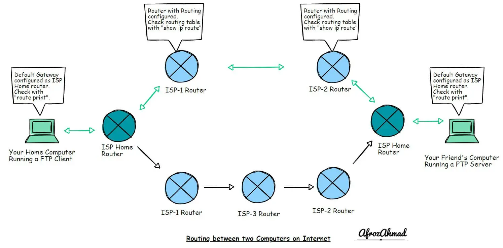
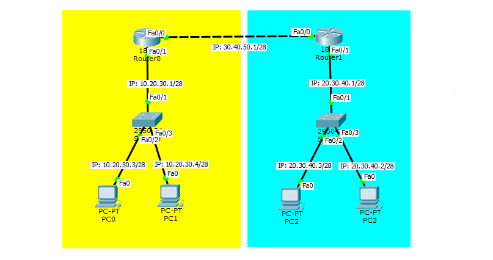
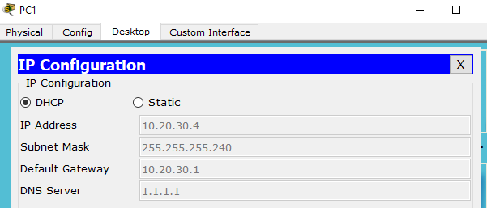
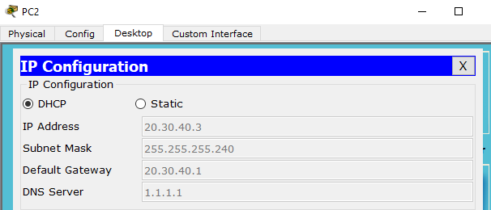
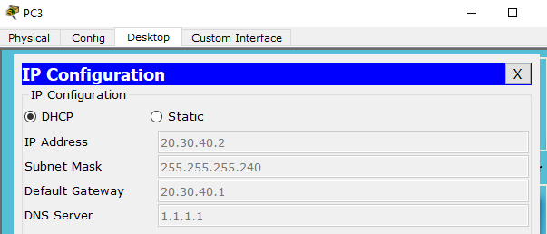
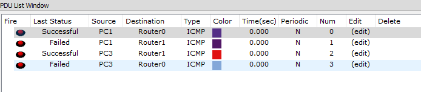
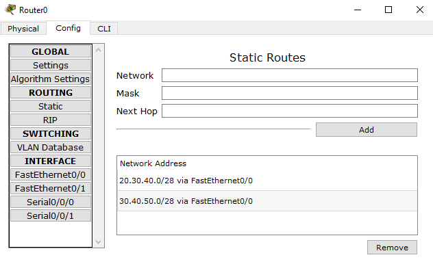
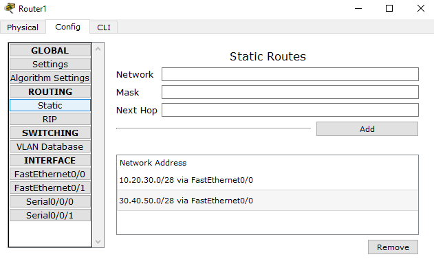
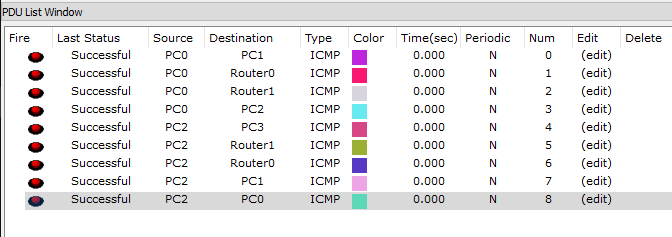

## Konfigurasi Routing Statis

### Pengertian
Routing adalah proses memilih jalur jaringan dalam suatu atau beberapa jaringan agar dapat menghubungkan satu jaringan denagn jaringan lain. Simpelnya menghubungkan antar Router. Jika tidak dilakukan Routing maka antar jaringan/Router tidak bisa saling berkumunikasi.



### Topologi Sederhana Untuk Routing



Terdapat 2 Router dan setiap Router dengan 1 Switch dan 2 PC. Konfigurasi IP pada Router 0 & 1 dengan:

- Port fa0/0 set IP statik
- Port fa0/1 set IP statik dan berikan DHCP Server.

Untuk konfigurasi IP pada Router.
#### Router 0
Konfigurasi IP pada port Fa0/1.
```Txt
Router(config)#interface fastEthernet 0/1
Router(config-if)#ip address 10.20.30.1 255.255.255.240
Router(config-if)#no shutdown
%LINK-5-CHANGED: Interface FastEthernet0/0, changed state to up

%LINEPROTO-5-UPDOWN: Line protocol on Interface FastEthernet0/0, changed state to up
Router(config-if)#exit
Router(config)#
```
Lalu konfigurasi DHCP Server & IP excluded.
```Txt
Router(config)#service dhcp
Router(config)#ip dhcp pool POOL_1
Router(dhcp-config)#network 10.20.30.0 255.255.255.240
Router(dhcp-config)#default-router 10.20.30.1
Router(dhcp-config)#dns-server 1.1.1.1
Router(dhcp-config)#exit
Router(config)#ip dhcp excluded-address 10.20.30.1
```
Lalu pada port Fa0/0.
```Txt
Router(config)#interface fastEthernet 0/0
Router(config-if)#ip address 30.40.50.1 255.255.255.240
Router(config-if)#no shutdown
%LINK-5-CHANGED: Interface FastEthernet0/0, changed state to up

%LINEPROTO-5-UPDOWN: Line protocol on Interface FastEthernet0/0, changed state to up
```
Untuk hasil konfigursi.
```Txt
Router#show running-config
...
!
ip dhcp excluded-address 10.20.30.1
!
ip dhcp pool POOL_1
 network 10.20.30.0 255.255.255.240
 default-router 10.20.30.1
 dns-server 1.1.1.1
!
...
!
interface FastEthernet0/0
 ip address 30.40.50.1 255.255.255.240
 duplex auto
 speed auto
!
interface FastEthernet0/1
 ip address 10.20.30.1 255.255.255.240
 duplex auto
 speed auto
!
...
```
Lalu pada PC0 & PC1 set IP DHCP.
#### PC0

#### PC1


#### Router 1
Konfigurasi IP pada port Fa0/1.
```Txt
Router(config)#interface fastEthernet 0/1
Router(config-if)#ip address 20.30.40.1 255.255.255.240
Router(config-if)#no shutdown
%LINK-5-CHANGED: Interface FastEthernet0/0, changed state to up

%LINEPROTO-5-UPDOWN: Line protocol on Interface FastEthernet0/0, changed state to up
Router(config-if)#exit
Router(config)#
```
Lalu konfigurasi DHCP Server & IP excluded.
```Txt
Router(config)#service dhcp
Router(config)#ip dhcp pool POOL_2
Router(dhcp-config)#network 20.30.40.0 255.255.255.240
Router(dhcp-config)#default-router 20.30.40.1
Router(dhcp-config)#dns-server 1.1.1.1
Router(dhcp-config)#exit
Router(config)#ip dhcp excluded-address 20.30.40.1
```
Lalu pada port Fa0/0.
```Txt
Router(config)#interface fastEthernet 0/0
Router(config-if)#ip address 30.40.50.2 255.255.255.240
Router(config-if)#no shutdown
%LINK-5-CHANGED: Interface FastEthernet0/0, changed state to up

%LINEPROTO-5-UPDOWN: Line protocol on Interface FastEthernet0/0, changed state to up
```
Untuk hasil konfigursi.
```Txt
Router#show running-config
...
!
ip dhcp excluded-address 20.30.40.1
!
ip dhcp pool POOL_2
 network 20.30.40.0 255.255.255.240
 default-router 20.30.40.1
 dns-server 1.1.1.1
!
...
!
interface FastEthernet0/0
 ip address 30.40.50.2 255.255.255.240
 duplex auto
 speed auto
!
interface FastEthernet0/1
 ip address 20.30.40.1 255.255.255.240
 duplex auto
 speed auto
!
...
```
Lalu pada PC2 & PC3 set IP DHCP.
#### PC2

#### PC3


### Pengujian Sebelum Routing
Pengujian dengan Ping atau simple PDU sebelum dilakukan Routing.  
**PC0**

- Ping IP Fa0/1 Router 0
- Ping IP Fa0/0 Router 0
- Ping IP Fa0/0 Router 1

```Txt
PC>ping 10.20.30.1

Pinging 10.20.30.1 with 32 bytes of data:

Reply from 10.20.30.1: bytes=32 time=1ms TTL=255
Reply from 10.20.30.1: bytes=32 time=0ms TTL=255
Reply from 10.20.30.1: bytes=32 time=0ms TTL=255
Reply from 10.20.30.1: bytes=32 time=0ms TTL=255

Ping statistics for 10.20.30.1:
    Packets: Sent = 4, Received = 4, Lost = 0 (0% loss),
Approximate round trip times in milli-seconds:
    Minimum = 0ms, Maximum = 1ms, Average = 0ms

PC>ping 30.40.50.1

Pinging 30.40.50.1 with 32 bytes of data:

Reply from 30.40.50.1: bytes=32 time=0ms TTL=255
Reply from 30.40.50.1: bytes=32 time=3ms TTL=255
Reply from 30.40.50.1: bytes=32 time=0ms TTL=255
Reply from 30.40.50.1: bytes=32 time=1ms TTL=255

Ping statistics for 30.40.50.1:
    Packets: Sent = 4, Received = 4, Lost = 0 (0% loss),
Approximate round trip times in milli-seconds:
    Minimum = 0ms, Maximum = 3ms, Average = 1ms

PC>ping 30.40.50.2

Pinging 30.40.50.2 with 32 bytes of data:

Reply from 30.40.50.2: Destination host unreachable.
Reply from 30.40.50.2: Destination host unreachable.
Reply from 30.40.50.2: Destination host unreachable.
Reply from 30.40.50.2: Destination host unreachable.

Ping statistics for 30.40.50.2:
    Packets: Sent = 4, Received = 0, Lost = 4 (100% loss),
```
**PC 2**

- Ping IP Fa0/1 Router 1
- Ping IP Fa0/0 Router 1
- Ping IP Fa0/0 Router 0

```Txt
PC>ping 20.30.40.1

Pinging 20.30.40.1 with 32 bytes of data:

Reply from 20.30.40.1: bytes=32 time=1ms TTL=255
Reply from 20.30.40.1: bytes=32 time=0ms TTL=255
Reply from 20.30.40.1: bytes=32 time=0ms TTL=255
Reply from 20.30.40.1: bytes=32 time=1ms TTL=255

Ping statistics for 20.30.40.1:
    Packets: Sent = 4, Received = 4, Lost = 0 (0% loss),
Approximate round trip times in milli-seconds:
    Minimum = 0ms, Maximum = 1ms, Average = 0ms

PC>ping 30.40.50.2

Pinging 30.40.50.2 with 32 bytes of data:

Reply from 30.40.50.2: bytes=32 time=0ms TTL=255
Reply from 30.40.50.2: bytes=32 time=0ms TTL=255
Reply from 30.40.50.2: bytes=32 time=0ms TTL=255
Reply from 30.40.50.2: bytes=32 time=0ms TTL=255

Ping statistics for 30.40.50.2:
    Packets: Sent = 4, Received = 4, Lost = 0 (0% loss),
Approximate round trip times in milli-seconds:
    Minimum = 0ms, Maximum = 2ms, Average = 0ms

PC>ping 30.40.50.1

Pinging 30.40.50.1 with 32 bytes of data:

Reply from 30.40.50.1: Destination host unreachable.
Reply from 30.40.50.1: Destination host unreachable.
Reply from 30.40.50.1: Destination host unreachable.
Reply from 30.40.50.1: Destination host unreachable.

Ping statistics for 30.40.50.1:
    Packets: Sent = 4, Received = 0, Lost = 4 (100% loss),
```
**Untuk hasil pengujian dengan simple PDU**



### Konfigurasi Routing Statik
Konfigurasi Routing pada **Router 0**, maka IP Network yang dimasukan:

- IP Network Antara Router 0 dan Router 1
- IP Network Jalur di dalam jaringan Router 1

```Txt
Router>enable
Router#configure terminal 
Enter configuration commands, one per line.  End with CNTL/Z.
Router(config)#ip route 30.40.50.0 255.255.255.240 FastEthernet 0/0
Router(config)#ip route 20.30.40.0 255.255.255.240 FastEthernet 0/0
```
Untuk hasil konfigurasi bisa dilihat pada menu Static.



Konfigurasi Routing pada **Router 1**, maka IP Network yang dimasukan:

- IP Network Antara Router 1 dan Router 0
- IP Network Jalur di dalam jaringan Router 0

```Txt
Router>enable 
Router#configure terminal 
Enter configuration commands, one per line.  End with CNTL/Z.
Router(config)#ip route 30.40.50.0 255.255.255.240 FastEthernet 0/0
Router(config)#ip route 10.20.30.0 255.255.255.240 FastEthernet 0/0
```
Untuk hasil konfigurasi bisa dilihat pada menu Static.



### Pengujian Setelah Routing Statik
Pengujian dengan Ping.

**PC1**

- Ping IP Router1 Port Fa0/0
- Ping IP PC2

```Txt
PC>ping 30.40.50.2

Pinging 30.40.50.2 with 32 bytes of data:

Reply from 30.40.50.2: bytes=32 time=1ms TTL=254
Reply from 30.40.50.2: bytes=32 time=0ms TTL=254
Reply from 30.40.50.2: bytes=32 time=0ms TTL=254
Reply from 30.40.50.2: bytes=32 time=0ms TTL=254

Ping statistics for 30.40.50.2:
    Packets: Sent = 4, Received = 4, Lost = 0 (0% loss),
Approximate round trip times in milli-seconds:
    Minimum = 0ms, Maximum = 1ms, Average = 0ms

PC>ping 20.30.40.2

Pinging 20.30.40.2 with 32 bytes of data:

Reply from 20.30.40.2: bytes=32 time=1ms TTL=126
Reply from 20.30.40.2: bytes=32 time=0ms TTL=126
Reply from 20.30.40.2: bytes=32 time=0ms TTL=126
Reply from 20.30.40.2: bytes=32 time=0ms TTL=126

Ping statistics for 20.30.40.2:
    Packets: Sent = 4, Received = 4, Lost = 0 (0% loss),
Approximate round trip times in milli-seconds:
    Minimum = 0ms, Maximum = 1ms, Average = 0ms
```
**PC3**

- Ping IP Router0 Port Fa0/0
- Ping IP PC0

```Txt
PC>ping 30.40.50.1

Pinging 30.40.50.1 with 32 bytes of data:

Reply from 30.40.50.1: bytes=32 time=1ms TTL=254
Reply from 30.40.50.1: bytes=32 time=0ms TTL=254
Reply from 30.40.50.1: bytes=32 time=0ms TTL=254
Reply from 30.40.50.1: bytes=32 time=0ms TTL=254

Ping statistics for 30.40.50.1:
    Packets: Sent = 4, Received = 4, Lost = 0 (0% loss),
Approximate round trip times in milli-seconds:
    Minimum = 0ms, Maximum = 1ms, Average = 0ms

PC>ping 10.20.30.3

Pinging 10.20.30.3 with 32 bytes of data:

Reply from 10.20.30.3: bytes=32 time=4ms TTL=126
Reply from 10.20.30.3: bytes=32 time=0ms TTL=126
Reply from 10.20.30.3: bytes=32 time=1ms TTL=126
Reply from 10.20.30.3: bytes=32 time=0ms TTL=126

Ping statistics for 10.20.30.3:
    Packets: Sent = 4, Received = 4, Lost = 0 (0% loss),
Approximate round trip times in milli-seconds:
    Minimum = 0ms, Maximum = 4ms, Average = 1ms
```
Pengujian dengan simple PDU.

