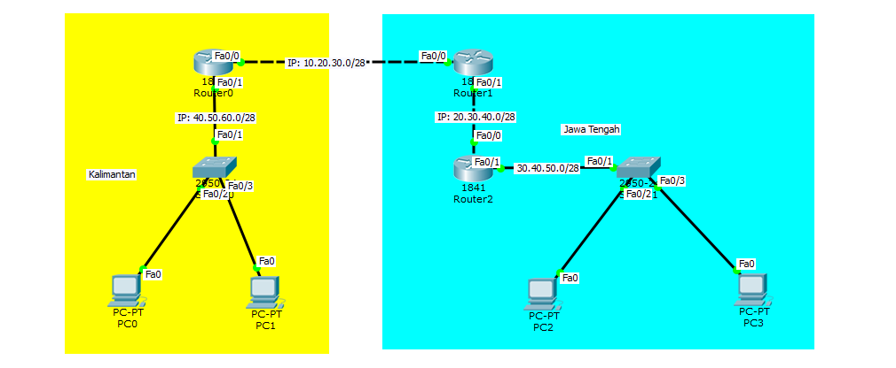

## Konfigurasi Routing Dinamis RIP

### Pengertian
RIP (Routing Information Protocol) adalah protokol routing dinamis. Protokol ini menggunakan algoritma Distance – Vector Routing. Protokol RIP memperbarui tabel routing berdasarkan router yang terhubung langsung, kemudian router selanjutnya akan memberikan informasi mengenai router selanjutnya yang terhubung dengan router tersebut. Informasi yang ditukarkan oleh RIP adalah Host, Network, Subnet, rute default.

### Topologi Sederhana Untuk Routing Dinamis (RIP)


### Konfigurasi IP Pada Setiap Router
#### [Router 0]
Konfigurasi IP pada Port Fa0/1
```Txt
Router>enable 
Router#configure terminal 
Enter configuration commands, one per line.  End with CNTL/Z.
Router(config)#interface fastEthernet 0/1
Router(config-if)#ip address 40.50.60.1 255.255.255.240
Router(config-if)#no shutdown 
%LINK-5-CHANGED: Interface FastEthernet0/1, changed state to up

```
Lalu konfigurasi DHCP.
```Txt
Router(config)#service dhcp
Router(config)#ip dhcp pool POOL_1
Router(dhcp-config)#network 40.50.60.0 255.255.255.240
Router(dhcp-config)#default-router 40.50.60.1
Router(dhcp-config)#dns-server 1.1.1.1
Router(dhcp-config)#exit
Router(config)#ip dhcp excluded-address 40.50.60.1
```
Lalu konfigurasi pada Port Fa0/0
```Txt
Router#configure terminal 
Enter configuration commands, one per line.  End with CNTL/Z.
Router(config)#interface fastEthernet 0/0
Router(config-if)#ip address 10.20.30.1 255.255.255.240
Router(config-if)#no shutdown 
%LINK-5-CHANGED: Interface FastEthernet0/0, changed state to up

```
Untuk hasil konfigurasi.
```Txt
...
!
ip dhcp excluded-address 40.50.60.1
!
ip dhcp pool POOL_1
 network 40.50.60.0 255.255.255.240
 default-router 40.50.60.1
 dns-server 1.1.1.1
!
...
!
interface FastEthernet0/0
 ip address 10.20.30.1 255.255.255.240
 duplex auto
 speed auto
!
interface FastEthernet0/1
 ip address 40.50.60.1 255.255.255.240
 duplex auto
 speed auto
!
...
```
Lalu pada PC0 & PC1 set IP DHCP.
#### [PC0]


#### [PC1]


#### [Router 1]
Konfigurasi IP pada Port Fa0/1
```Txt
Router#configure terminal 
Enter configuration commands, one per line.  End with CNTL/Z.
Router(config)#interface fastEthernet 0/1
Router(config-if)#ip address 20.30.40.1 255.255.255.240
Router(config-if)#no shutdown 
%LINK-5-CHANGED: Interface FastEthernet0/1, changed state to up

```
Lalu konfigurasi IP pada Port Fa0/0
```Txt
Router(config)#interface fastEthernet 0/0
Router(config-if)#ip address 10.20.30.2 255.255.255.240
Router(config-if)#no shutdown 
%LINK-5-CHANGED: Interface FastEthernet0/0, changed state to up

%LINEPROTO-5-UPDOWN: Line protocol on Interface FastEthernet0/0, changed state to up
```
Untuk hasil konfigurasi.
```Txt
Router#show running-config
...
!
interface FastEthernet0/0
 ip address 10.20.30.2 255.255.255.240
 duplex auto
 speed auto
!
interface FastEthernet0/1
 ip address 20.30.40.1 255.255.255.240
 duplex auto
 speed auto
!
...
```
#### [Router 2]
Konfigurasi IP pada Port Fa0/1
```Txt
Router>enable
Router#configure terminal 
Enter configuration commands, one per line.  End with CNTL/Z.
Router(config)#interface fastEthernet 0/1
Router(config-if)#ip address 30.40.50.1 255.255.255.240
Router(config-if)#no shutdown 
%LINK-5-CHANGED: Interface FastEthernet0/1, changed state to up

```
Kemudian konfigurasi DHCP Server.
```Txt
Router(config)#service dhcp 
Router(config)#ip dhcp pool POOL_2
Router(dhcp-config)#network 30.40.50.0 255.255.255.240
Router(dhcp-config)#default-router 30.40.50.1
Router(dhcp-config)#dns-server 1.1.1.1
Router(dhcp-config)#exit
Router(config)#ip dhcp excluded-address 30.40.50.1
```
Lalu pada Port Fa0/0
```Txt
Router>enable
Router#configure terminal 
Enter configuration commands, one per line.  End with CNTL/Z.
Router(config)#interface fastEthernet 0/0
Router(config-if)#ip address 20.30.40.2 255.255.255.240
Router(config-if)#no shutdown 
%LINK-5-CHANGED: Interface FastEthernet0/0, changed state to up

```
Lalu pada PC2 & PC3 set IP DHCP.
#### [PC2]


#### [PC3]


### Pengujian PC Ping Sebelum Ruting
**Pengujian PC0 Ping:**

- Ping IP Router0 Port Fa0/1
- Ping IP router0 Port Fa0/0
- Ping IP Router1 Port Fa0/0

```Txt
PC>ping 40.50.60.1

Pinging 40.50.60.1 with 32 bytes of data:

Reply from 40.50.60.1: bytes=32 time=1ms TTL=255
Reply from 40.50.60.1: bytes=32 time=0ms TTL=255
Reply from 40.50.60.1: bytes=32 time=0ms TTL=255
Reply from 40.50.60.1: bytes=32 time=0ms TTL=255

Ping statistics for 40.50.60.1:
    Packets: Sent = 4, Received = 4, Lost = 0 (0% loss),
Approximate round trip times in milli-seconds:
    Minimum = 0ms, Maximum = 1ms, Average = 0ms

PC>ping 10.20.30.1

Pinging 10.20.30.1 with 32 bytes of data:

Reply from 10.20.30.1: bytes=32 time=0ms TTL=255
Reply from 10.20.30.1: bytes=32 time=0ms TTL=255
Reply from 10.20.30.1: bytes=32 time=0ms TTL=255
Reply from 10.20.30.1: bytes=32 time=0ms TTL=255

Ping statistics for 10.20.30.1:
    Packets: Sent = 4, Received = 4, Lost = 0 (0% loss),
Approximate round trip times in milli-seconds:
    Minimum = 0ms, Maximum = 0ms, Average = 0ms

PC>ping 10.20.30.2

Pinging 10.20.30.2 with 32 bytes of data:

Request timed out.
Request timed out.
Request timed out.
Request timed out.

Ping statistics for 10.20.30.2:
    Packets: Sent = 4, Received = 0, Lost = 4 (100% loss),
```
**Pengujian PC2 Ping:**

- Ping IP Router2 Port Fa0/1
- Ping IP Router2 Port Fa0/0
- Ping IP Router1 Port Fa0/1

```Txt
PC>ping 30.40.50.1

Pinging 30.40.50.1 with 32 bytes of data:

Reply from 30.40.50.1: bytes=32 time=1ms TTL=255
Reply from 30.40.50.1: bytes=32 time=0ms TTL=255
Reply from 30.40.50.1: bytes=32 time=0ms TTL=255
Reply from 30.40.50.1: bytes=32 time=0ms TTL=255

Ping statistics for 30.40.50.1:
    Packets: Sent = 4, Received = 4, Lost = 0 (0% loss),
Approximate round trip times in milli-seconds:
    Minimum = 0ms, Maximum = 1ms, Average = 0ms

PC>ping 20.30.40.2

Pinging 20.30.40.2 with 32 bytes of data:

Reply from 20.30.40.2: bytes=32 time=0ms TTL=255
Reply from 20.30.40.2: bytes=32 time=0ms TTL=255
Reply from 20.30.40.2: bytes=32 time=0ms TTL=255
Reply from 20.30.40.2: bytes=32 time=1ms TTL=255

Ping statistics for 20.30.40.2:
    Packets: Sent = 4, Received = 4, Lost = 0 (0% loss),
Approximate round trip times in milli-seconds:
    Minimum = 0ms, Maximum = 1ms, Average = 0ms

PC>ping 20.30.40.1

Pinging 20.30.40.1 with 32 bytes of data:

Request timed out.
Request timed out.
Request timed out.
Request timed out.

Ping statistics for 20.30.40.1:
    Packets: Sent = 4, Received = 0, Lost = 4 (100% loss),
```
### Pengujian Simple PDU Sebelum Ruting


### Konfigurasi Routing Dinamis(RIP)
#### [Router 0]
Konfigurasi RIP dengan memasukan IP Network:

- IP Network Router ke bawah (Fa0/1)
- IP Network Router ke Router selanjutnya (Fa0/0)

```Txt
Router>enable 
Router#configure terminal 
Enter configuration commands, one per line.  End with CNTL/Z.
Router(config)#router rip
Router(config-router)#version 2
Router(config-router)#network 40.50.60.0
Router(config-router)#network 10.20.30.0
Router(config-router)#exit
Router(config)#
```
#### [Router 1]
Konfigurasi RIP dengan memasukan IP Network:

- IP Network Router ke bawah (Fa0/1)
- IP Network Router ke Router selanjutnya (Fa0/0)

```Txt
Router>enable 
Router#configure terminal 
Enter configuration commands, one per line.  End with CNTL/Z.
Router(config)#router rip 
Router(config-router)#version 2
Router(config-router)#network 20.30.40.0
Router(config-router)#network 10.20.30.0
Router(config-router)#exit
Router(config)#
```
#### [Router 2]
Konfigurasi RIP dengan memasukan IP Network:

- IP Network Router ke bawah (Fa0/1)
- IP Network Router ke Router selanjutnya (Fa0/0)

```Txt
Router>enable 
Router#configure terminal 
Enter configuration commands, one per line.  End with CNTL/Z.
Router(config)#router rip 
Router(config-router)#version 2
Router(config-router)#network 30.40.50.0
Router(config-router)#network 20.30.40.0
Router(config-router)#exit
Router(config)#
```

### Pengujian Ping & Simple PDU Setelah Routing (RIP)
**Pengujian ping PC1:**

- Ping Router0
- Ping Router1
- Ping Router2

```Txt
PC>ping 10.20.30.1

Pinging 10.20.30.1 with 32 bytes of data:

Reply from 10.20.30.1: bytes=32 time=0ms TTL=255
Reply from 10.20.30.1: bytes=32 time=0ms TTL=255
Reply from 10.20.30.1: bytes=32 time=1ms TTL=255
Reply from 10.20.30.1: bytes=32 time=0ms TTL=255

Ping statistics for 10.20.30.1:
    Packets: Sent = 4, Received = 4, Lost = 0 (0% loss),
Approximate round trip times in milli-seconds:
    Minimum = 0ms, Maximum = 1ms, Average = 0ms

PC>ping 10.20.30.2

Pinging 10.20.30.2 with 32 bytes of data:

Reply from 10.20.30.2: bytes=32 time=0ms TTL=254
Reply from 10.20.30.2: bytes=32 time=0ms TTL=254
Reply from 10.20.30.2: bytes=32 time=8ms TTL=254
Reply from 10.20.30.2: bytes=32 time=0ms TTL=254

Ping statistics for 10.20.30.2:
    Packets: Sent = 4, Received = 4, Lost = 0 (0% loss),
Approximate round trip times in milli-seconds:
    Minimum = 0ms, Maximum = 8ms, Average = 2ms

PC>ping 20.30.40.2

Pinging 20.30.40.2 with 32 bytes of data:

Reply from 20.30.40.2: bytes=32 time=3ms TTL=253
Reply from 20.30.40.2: bytes=32 time=0ms TTL=253
Reply from 20.30.40.2: bytes=32 time=1ms TTL=253
Reply from 20.30.40.2: bytes=32 time=1ms TTL=253

Ping statistics for 20.30.40.2:
    Packets: Sent = 4, Received = 4, Lost = 0 (0% loss),
Approximate round trip times in milli-seconds:
    Minimum = 0ms, Maximum = 3ms, Average = 1ms
```

**Pengujian ping PC3:**

- Ping Router2
- Ping Router1
- Ping Router0

```Txt
PC>ping 30.40.50.1

Pinging 30.40.50.1 with 32 bytes of data:

Reply from 30.40.50.1: bytes=32 time=0ms TTL=255
Reply from 30.40.50.1: bytes=32 time=1ms TTL=255
Reply from 30.40.50.1: bytes=32 time=0ms TTL=255
Reply from 30.40.50.1: bytes=32 time=1ms TTL=255

Ping statistics for 30.40.50.1:
    Packets: Sent = 4, Received = 4, Lost = 0 (0% loss),
Approximate round trip times in milli-seconds:
    Minimum = 0ms, Maximum = 1ms, Average = 0ms

PC>ping 20.30.40.1

Pinging 20.30.40.1 with 32 bytes of data:

Reply from 20.30.40.1: bytes=32 time=0ms TTL=254
Reply from 20.30.40.1: bytes=32 time=1ms TTL=254
Reply from 20.30.40.1: bytes=32 time=0ms TTL=254
Reply from 20.30.40.1: bytes=32 time=0ms TTL=254

Ping statistics for 20.30.40.1:
    Packets: Sent = 4, Received = 4, Lost = 0 (0% loss),
Approximate round trip times in milli-seconds:
    Minimum = 0ms, Maximum = 1ms, Average = 0ms

PC>ping 10.20.30.1

Pinging 10.20.30.1 with 32 bytes of data:

Reply from 10.20.30.1: bytes=32 time=1ms TTL=253
Reply from 10.20.30.1: bytes=32 time=1ms TTL=253
Reply from 10.20.30.1: bytes=32 time=1ms TTL=253
Reply from 10.20.30.1: bytes=32 time=1ms TTL=253

Ping statistics for 10.20.30.1:
    Packets: Sent = 4, Received = 4, Lost = 0 (0% loss),
Approximate round trip times in milli-seconds:
    Minimum = 1ms, Maximum = 1ms, Average = 1ms
```

**Pengujian jika menggunakan simple PDU**


### Download File CPT(Cisco Packet Tracer)
#### [Download File](resource/2024_Ifandika_CPT-Dynamic-Routing-RIP.pkt)