## Konfigurasi DSL Modem

### Pengertian


### Topologi Untuk DSL Modem
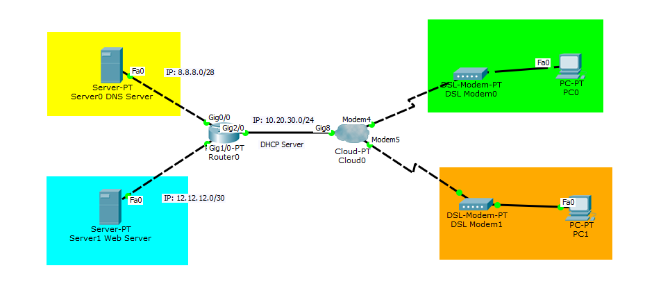

### Konfigurasi Router
### [Router0]
Gunakan Router Generic dan tambahkan Module untuk port GigabitEthernet.

- Module: PT-ROUTER-NM-1-CGE

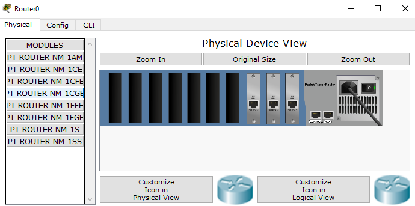

Lalu konfigurasi IP untuk Port gig0/0.
```Txt
Router>enable 
Router#configure terminal 
Enter configuration commands, one per line.  End with CNTL/Z.
Router(config)#interface gigabitEthernet 0/0
Router(config-if)#ip address 8.8.8.1 255.255.255.240
Router(config-if)#no shutdown 
%LINK-5-CHANGED: Interface GigabitEthernet0/0, changed state to up

%LINEPROTO-5-UPDOWN: Line protocol on Interface GigabitEthernet0/0, changed state to up
```
Lalu konfigurasi IP untuk Port gig1/0.
```Txt
Router(config)#interface gigabitEthernet 1/0
Router(config-if)#ip address 12.12.12.1 255.255.255.252
Router(config-if)#no shutdown 
%LINK-5-CHANGED: Interface GigabitEthernet1/0, changed state to up

%LINEPROTO-5-UPDOWN: Line protocol on Interface GigabitEthernet1/0, changed state to up
```
Lalu konfigurasi IP untuk Port gig2/0 dan DHCP Server.
```Txt
Router(config)#interface gigabitEthernet 2/0
Router(config-if)#ip address 10.20.30.1 255.255.255.0
Router(config-if)#no shutdown 

Router(config-if)#
%LINK-5-CHANGED: Interface GigabitEthernet2/0, changed state to up

%LINEPROTO-5-UPDOWN: Line protocol on Interface GigabitEthernet2/0, changed state to up

Router(config-if)#exit
Router(config)#service dhcp
Router(config)#ip dhcp pool Modem_Client1
Router(dhcp-config)#network 10.20.30.0 255.255.255.0
Router(dhcp-config)#default-router 10.20.30.1
Router(dhcp-config)#dns-server 8.8.8.8
Router(dhcp-config)#exit
Router(config)#ip dhcp excluded-address 10.20.30.1
```
Untuk hasil konfigurasinya.
```Txt
Router#show running-config
...
!
ip dhcp excluded-address 10.20.30.1
!
ip dhcp pool Modem_Client1
 network 10.20.30.0 255.255.255.0
 default-router 10.20.30.1
 dns-server 8.8.8.8
!
...
!
interface GigabitEthernet0/0
 ip address 8.8.8.1 255.255.255.240
 duplex auto
 speed auto
!
interface GigabitEthernet1/0
 ip address 12.12.12.1 255.255.255.252
 duplex auto
 speed auto
!
interface GigabitEthernet2/0
 ip address 10.20.30.1 255.255.255.0
 duplex auto
 speed auto
!
...
```

### Konfigurasi Web Server
Berikan IP Statis.

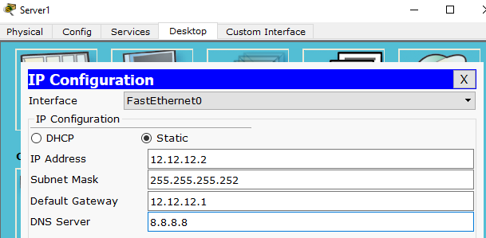

### Konfigurasi DNS Server
Berikan IP Statis.

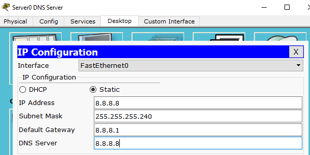

Lalu pada menu **Service > DNS** berikan:

- DNS Service: On
- Name: smk.bisa.net
- Address: 12.12.12.2

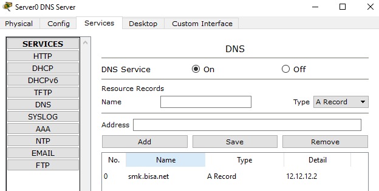

### Konfigurasi Cloud
Tambahkan module GigabitEthernet untuk saluran dari Router.

- Module: PT-ROUTER-NM-1-CGE

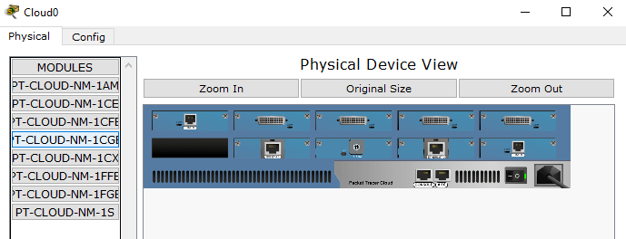

Lalu pada menu **Config > DSL** berikan:

- Add: Modem4(From Port) <=> GigabitEthernet(To Port)
- Add: Modem5(From Port) <=> GigabitEthernet(To Port)

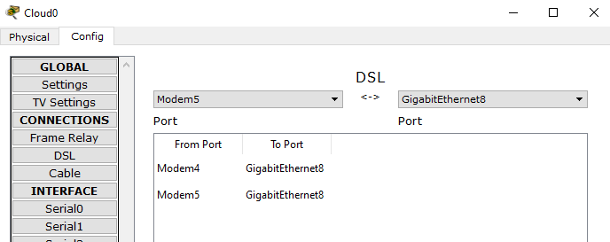

Lalu **Config > GigabitEthernet(Terhubung dengan Router)** set ke **DSL**.

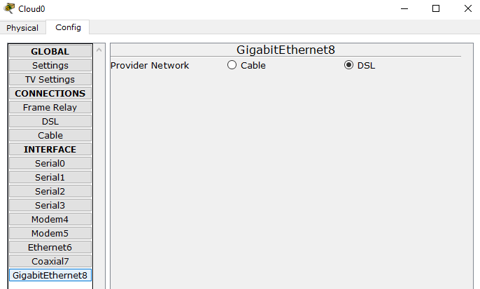

### [PC0]
Set IP ke DHCP.

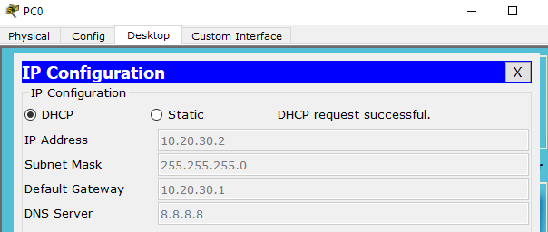

Lalu ke **Desktop > Web Browser** dan akses smk.bisa.net

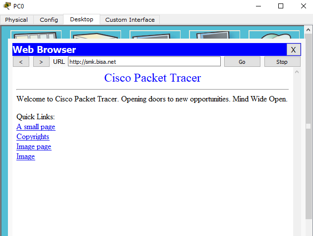

### [PC1]
Set IP ke DHCP.

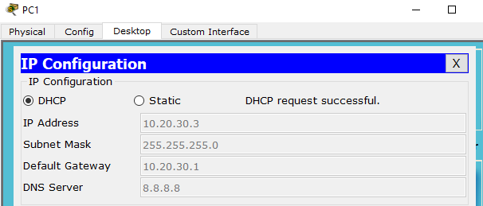

Lalu ke **Desktop > Web Browser** dan akses smk.bisa.net

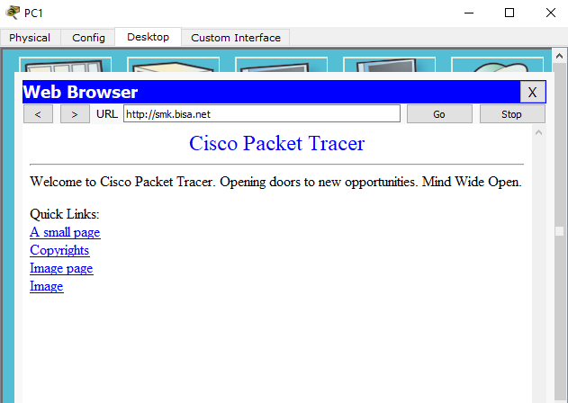