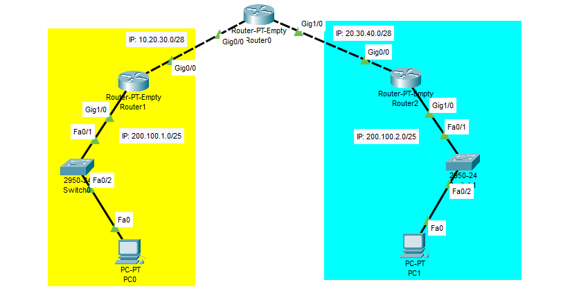
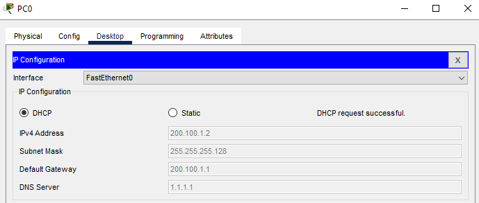
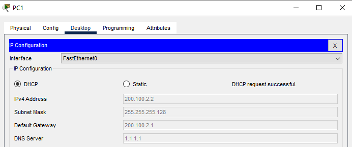

## Konfigurasi Routing OSPF Cisco Packet Tracer

### Pengertian
OSPF (Open Shortest Path First) merupakan sebuah protokol routing otomatis (Dynamic Routing) yang mampu menjaga, mengatur dan mendistribusikan informasi routing antar network mengikuti setiap perubahan jaringan secara dinamis.

Pada OSPF dikenal sebuah istilah Autonomos System (AS) yaitu sebuah gabungan dari beberapa jaringan yang sifatnya routing dan memiliki kesamaan metode serta policy pengaturan network, yang semuanya dapat dikendalikan oleh network administrator. Dan memang kebanyakan fitur ini digunakan untuk management  dalam jaringan dengan skala yang sangat besar. Oleh karena itu, untuk mempermudah penambahan informasi routing dan meminimalisir kesalahan distribusi informasi routing, maka OSPF bisa menjadi sebuah solusi.

OSPF termasuk dalam kategori IGP (Interior Gateway Protocol) yang memiliki kemampuan Link-State dan Algoritma Djikstra yang jauh lebih efesien dibandingkan protokol IGP yang lain.

### Topologi Untuk Routing OSPF


### Konfigurasi Router
### [Router0]
Konfigurasi IP pada port Gig0/0.
```Txt
Router>enable 
Router#configure terminal 
Enter configuration commands, one per line.  End with CNTL/Z.
Router(config)#interface gigabitEthernet 0/0
Router(config-if)#ip address 10.20.30.1 255.255.255.240
Router(config-if)#no shutdown 

Router(config-if)#
%LINK-5-CHANGED: Interface GigabitEthernet0/0, changed state to up

Router(config-if)#exit
Router(config)#
```
Lalu pada port Gig1/0.
```Txt
Router(config)#interface gigabitEthernet 1/0
Router(config-if)#ip address 20.30.40.1 255.255.255.240
Router(config-if)#no shutdown 

Router(config-if)#
%LINK-5-CHANGED: Interface GigabitEthernet1/0, changed state to up

Router(config-if)#exit
Router(config)#
```
### [Router1]
Konfigurasi pada port Gig0/0 untuk menghubungkan ke Router0.
```Txt
Router>enable 
Router#configure terminal 
Enter configuration commands, one per line.  End with CNTL/Z.
Router(config)#interface gigabitEthernet 0/0
Router(config-if)#ip address 10.20.30.2 255.255.255.240
Router(config-if)#no shutdown 

Router(config-if)#
%LINK-5-CHANGED: Interface GigabitEthernet0/0, changed state to up

%LINEPROTO-5-UPDOWN: Line protocol on Interface GigabitEthernet0/0, changed state to up
Router(config-if)#exit 
Router(config)#
```
Konfigurasi IP pada port Gig1/0 ke arah Jaringan Lokal (Switch) dan DHCP Server.
```Txt
Router(config)#interface gigabitEthernet 1/0
Router(config-if)#ip address 200.100.1.1 255.255.255.128
Router(config-if)#no shutdown 

Router(config-if)#
%LINK-5-CHANGED: Interface GigabitEthernet1/0, changed state to up

%LINEPROTO-5-UPDOWN: Line protocol on Interface GigabitEthernet1/0, changed state to up
Router(config-if)#exit 
Router(config)#service dhcp 
Router(config)#ip dhcp pool POOL_Local1
Router(dhcp-config)#network 200.100.1.0 255.255.255.128
Router(dhcp-config)#default-router 200.100.1.1
Router(dhcp-config)#dns-server 1.1.1.1
Router(dhcp-config)#exit 
Router(config)#ip dhcp excluded-address 200.100.1.1
```

### [Router2]
Konfigurasi pada port Gig0/0 untuk menghubugkan ke Router0.
```Txt
Router>enable 
Router#configure terminal 
Enter configuration commands, one per line.  End with CNTL/Z.
Router(config)#interface gigabitEthernet 0/0
Router(config-if)#ip address 20.30.40.2 255.255.255.240
Router(config-if)#no shutdown 

Router(config-if)#
%LINK-5-CHANGED: Interface GigabitEthernet0/0, changed state to up

%LINEPROTO-5-UPDOWN: Line protocol on Interface GigabitEthernet0/0, changed state to up

Router(config-if)#exit
Router(config)#
```
Lalu konfigurasi port Gig1/0 ke jaringan lokal (Switch) dan DHCP Server.
```Txt
Router(config)#interface gigabitEthernet 1/0
Router(config-if)#ip address 200.100.1.1 255.255.255.128
Router(config-if)#no shutdown 

Router(config-if)#
%LINK-5-CHANGED: Interface GigabitEthernet1/0, changed state to up

%LINEPROTO-5-UPDOWN: Line protocol on Interface GigabitEthernet1/0, changed state to up

Router(config-if)#exit
Router(config)#service dhcp 
Router(config)#ip dhcp pool POOL_Local2
Router(dhcp-config)#network 200.100.1.0 255.255.255.128
Router(dhcp-config)#default-router 200.100.1.1
Router(dhcp-config)#dns-server 1.1.1.1
Router(dhcp-config)#exit
Router(config)#ip dhcp excluded-address 200.100.1.1
```

### Konfigurasi PC
### [PC0]
Set IP Address ke DHCP.



### [PC1]
Set IP Address ke DHCP.




