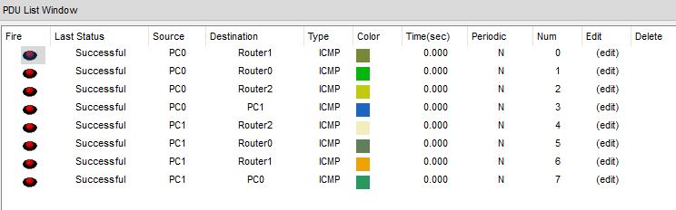
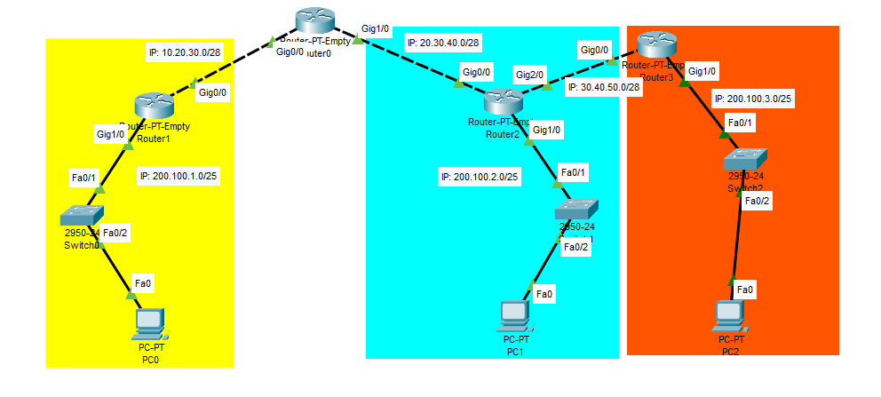
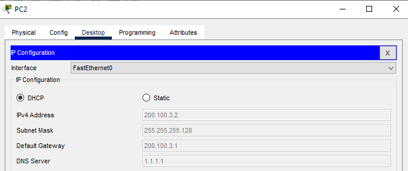
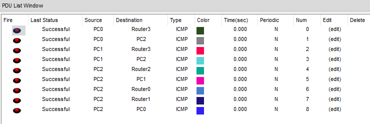

## Konfigurasi Routing OSPF Cisco Packet Tracer

### Pengertian
OSPF (Open Shortest Path First) merupakan sebuah protokol routing otomatis (Dynamic Routing) yang mampu menjaga, mengatur dan mendistribusikan informasi routing antar network mengikuti setiap perubahan jaringan secara dinamis.

Pada OSPF dikenal sebuah istilah Autonomos System (AS) yaitu sebuah gabungan dari beberapa jaringan yang sifatnya routing dan memiliki kesamaan metode serta policy pengaturan network, yang semuanya dapat dikendalikan oleh network administrator. Dan memang kebanyakan fitur ini digunakan untuk management  dalam jaringan dengan skala yang sangat besar. Oleh karena itu, untuk mempermudah penambahan informasi routing dan meminimalisir kesalahan distribusi informasi routing, maka OSPF bisa menjadi sebuah solusi.

OSPF termasuk dalam kategori IGP (Interior Gateway Protocol) yang memiliki kemampuan Link-State dan Algoritma Djikstra yang jauh lebih efesien dibandingkan protokol IGP yang lain.

### Topologi Untuk Routing OSPF


### Konfigurasi Router
#### [Router0]
Konfigurasi IP pada port Gig0/0.
```Txt
Router>enable 
Router#configure terminal 
Enter configuration commands, one per line.  End with CNTL/Z.
Router(config)#interface gigabitEthernet 0/0
Router(config-if)#ip address 10.20.30.1 255.255.255.240
Router(config-if)#no shutdown 

Router(config-if)#
%LINK-5-CHANGED: Interface GigabitEthernet0/0, changed state to up

Router(config-if)#exit
Router(config)#
```
Lalu pada port Gig1/0.
```Txt
Router(config)#interface gigabitEthernet 1/0
Router(config-if)#ip address 20.30.40.1 255.255.255.240
Router(config-if)#no shutdown 

Router(config-if)#
%LINK-5-CHANGED: Interface GigabitEthernet1/0, changed state to up

Router(config-if)#exit
Router(config)#
```
#### [Router1]
Konfigurasi pada port Gig0/0 untuk menghubungkan ke Router0.
```Txt
Router>enable 
Router#configure terminal 
Enter configuration commands, one per line.  End with CNTL/Z.
Router(config)#interface gigabitEthernet 0/0
Router(config-if)#ip address 10.20.30.2 255.255.255.240
Router(config-if)#no shutdown 

Router(config-if)#
%LINK-5-CHANGED: Interface GigabitEthernet0/0, changed state to up

%LINEPROTO-5-UPDOWN: Line protocol on Interface GigabitEthernet0/0, changed state to up
Router(config-if)#exit 
Router(config)#
```
Konfigurasi IP pada port Gig1/0 ke arah Jaringan Lokal (Switch) dan DHCP Server.
```Txt
Router(config)#interface gigabitEthernet 1/0
Router(config-if)#ip address 200.100.1.1 255.255.255.128
Router(config-if)#no shutdown 

Router(config-if)#
%LINK-5-CHANGED: Interface GigabitEthernet1/0, changed state to up

%LINEPROTO-5-UPDOWN: Line protocol on Interface GigabitEthernet1/0, changed state to up
Router(config-if)#exit 
Router(config)#service dhcp 
Router(config)#ip dhcp pool POOL_Local1
Router(dhcp-config)#network 200.100.1.0 255.255.255.128
Router(dhcp-config)#default-router 200.100.1.1
Router(dhcp-config)#dns-server 1.1.1.1
Router(dhcp-config)#exit 
Router(config)#ip dhcp excluded-address 200.100.1.1
```

#### [Router2]
Konfigurasi pada port Gig0/0 untuk menghubugkan ke Router0.
```Txt
Router>enable 
Router#configure terminal 
Enter configuration commands, one per line.  End with CNTL/Z.
Router(config)#interface gigabitEthernet 0/0
Router(config-if)#ip address 20.30.40.2 255.255.255.240
Router(config-if)#no shutdown 

Router(config-if)#
%LINK-5-CHANGED: Interface GigabitEthernet0/0, changed state to up

%LINEPROTO-5-UPDOWN: Line protocol on Interface GigabitEthernet0/0, changed state to up

Router(config-if)#exit
Router(config)#
```
Lalu konfigurasi port Gig1/0 ke jaringan lokal (Switch) dan DHCP Server.
```Txt
Router(config)#interface gigabitEthernet 1/0
Router(config-if)#ip address 200.100.2.1 255.255.255.128
Router(config-if)#no shutdown 

Router(config-if)#
%LINK-5-CHANGED: Interface GigabitEthernet1/0, changed state to up

%LINEPROTO-5-UPDOWN: Line protocol on Interface GigabitEthernet1/0, changed state to up

Router(config-if)#exit
Router(config)#service dhcp 
Router(config)#ip dhcp pool POOL_Local2
Router(dhcp-config)#network 200.100.2.0 255.255.255.128
Router(dhcp-config)#default-router 200.100.2.1
Router(dhcp-config)#dns-server 1.1.1.1
Router(dhcp-config)#exit
Router(config)#ip dhcp excluded-address 200.100.2.1
```

### Konfigurasi PC
#### [PC0]
Set IP Address ke DHCP.


#### [PC1]
Set IP Address ke DHCP.


### Pengujian Sebelum Konfigurasi Routing OSPF
#### [PC0 Ping PC1]
```Txt
C:\>ping 200.100.2.2

Pinging 200.100.2.2 with 32 bytes of data:

Reply from 200.100.1.1: Destination host unreachable.
Reply from 200.100.1.1: Destination host unreachable.
Reply from 200.100.1.1: Destination host unreachable.
Reply from 200.100.1.1: Destination host unreachable.

Ping statistics for 200.100.2.2:
    Packets: Sent = 4, Received = 0, Lost = 4 (100% loss),
```
#### [PC1 Ping PC0]
```Txt
C:\>ping 200.100.1.2

Pinging 200.100.1.2 with 32 bytes of data:

Reply from 200.100.2.1: Destination host unreachable.
Reply from 200.100.2.1: Destination host unreachable.
Reply from 200.100.2.1: Destination host unreachable.
Reply from 200.100.2.1: Destination host unreachable.

Ping statistics for 200.100.1.2:
    Packets: Sent = 4, Received = 0, Lost = 4 (100% loss),
```

### Konfigurasi Routing OSPF
Dilakukan pada semua Router, untuk perintah konfigurasi OSP.
```Txt
Router(config)#router ospf "proses_id"
Router(config-router)#network "ip_network" "wildcard_mask" area "no"
```
Untuk tabel IP Netmask List.
#### [Router0]
```Txt
Router>enable
Router#configure terminal
Enter configuration commands, one per line.  End with CNTL/Z.
Router(config)#router ospf 1
Router(config-router)#network 10.20.30.0 0.0.0.15 area 0
Router(config-router)#network 20.30.40.0 0.0.0.15 area 0
Router(config-router)#exit
Router(config)#
```
#### [Router1]
```Txt
Router>enable
Router#configure terminal 
Enter configuration commands, one per line.  End with CNTL/Z.
Router(config)#router ospf 1
Router(config-router)#network 10.20.30.0 0.0.0.15 area 0
00:19:36: %OSPF-5-ADJCHG: Process 1, Nbr 20.30.40.1 on GigabitEthernet0/0 from LOADING to FULL, Loading Done

% Incomplete command.
Router(config-router)#network 200.100.1.0 0.0.0.127 area 0
Router(config-router)#exit
Router(config#
```
#### [Router2]
```Txt
Router>enable 
Router#configure terminal 
Enter configuration commands, one per line.  End with CNTL/Z.
Router(config)#router ospf 1
Router(config-router)#network 20.30.40.0 0.0.0.15 area 0
00:22:56: %OSPF-5-ADJCHG: Process 1, Nbr 20.30.40.1 on GigabitEthernet0/0 from LOADING to FULL, Loading Done

% Incomplete command.
Router(config-router)#network 200.100.2.0 0.0.0.127 area 0
Router(config-router)#exit
Router(config)#
```

### Pengujian Setelah Routing OSPF
#### [PC0 Ping PC1]
```Txt
C:\>ping 200.100.2.2

Pinging 200.100.2.2 with 32 bytes of data:

Reply from 200.100.2.2: bytes=32 time<1ms TTL=125
Reply from 200.100.2.2: bytes=32 time=10ms TTL=125
Reply from 200.100.2.2: bytes=32 time=10ms TTL=125
Reply from 200.100.2.2: bytes=32 time=1ms TTL=125

Ping statistics for 200.100.2.2:
    Packets: Sent = 4, Received = 4, Lost = 0 (0% loss),
Approximate round trip times in milli-seconds:
    Minimum = 0ms, Maximum = 10ms, Average = 5ms
```
#### [PC1 Ping PC0]
```Txt
C:\>ping 200.100.1.2

Pinging 200.100.1.2 with 32 bytes of data:

Reply from 200.100.1.2: bytes=32 time<1ms TTL=125
Reply from 200.100.1.2: bytes=32 time<1ms TTL=125
Reply from 200.100.1.2: bytes=32 time=1ms TTL=125
Reply from 200.100.1.2: bytes=32 time=12ms TTL=125

Ping statistics for 200.100.1.2:
    Packets: Sent = 4, Received = 4, Lost = 0 (0% loss),
Approximate round trip times in milli-seconds:
    Minimum = 0ms, Maximum = 12ms, Average = 3ms
```
### Pengujian Dengan Simple PDU


### Menambah Jaringan Baru


### Konfigurasi Router
#### [Router2]
Konfigurasi IP port ge2/0
```Txt
Router(config)#interface GigabitEthernet2/0
Router(config-if)#ip ad
Router(config-if)#ip address 30.40.50.1 255.255.255.240
Router(config-if)#no shutdown

Router(config-if)#
%LINK-5-CHANGED: Interface GigabitEthernet2/0, changed state to up

Router(config-if)#exit
Router(config)#
```

#### [Router3]
Konfigurasi port ge0/0
```Txt
Router(config)#interface GigabitEthernet0/0
Router(config-if)#ip add
Router(config-if)#ip address 30.40.50.2 255.255.255.240
Router(config-if)#no shutdown

Router(config-if)#
%LINK-5-CHANGED: Interface GigabitEthernet0/0, changed state to up

%LINEPROTO-5-UPDOWN: Line protocol on Interface GigabitEthernet0/0, changed state to up

Router(config-if)#exit
Router(config)#
```
Lalu pada port ge1/0 ke jaringan lokal (Switch) dan DHCP Server.
```Txt
Router(config)#service dhcp 
Router(config)#ip dhcp pool POOL_Local3
Router(dhcp-config)#network 200.100.3.0 255.255.255.128
Router(dhcp-config)#default-router 200.100.3.1
Router(dhcp-config)#dns-server 1.1.1.1
Router(dhcp-config)#exit
Router(config)#ip dhcp excluded-address 200.100.3.1
```

#### [PC2]
Set IP ke DHCP pada menu **Desktop > IP Address**.


Jika tes ping dari PC1 ke PC2 maka gagal karena pada **Router2** dan **Router3** belum konfigurasi OSPF. Untuk **Router0** dan **Router1** tidak perlu karena jaringan baru melewati **Router2**.

### Konfigurasi Routing OSPF
#### [Router2]
```Txt
Router(config)#router ospf 1
Router(config-router)#network 30.40.50.0 0.0.0.15 area 0
Router(config-router)#exit
Router(config)#
```
#### [Router3]
```Txt
Router>enable
Router#configure terminal
Enter configuration commands, one per line.  End with CNTL/Z.
Router(config)#router ospf 1
Router(config-router)#network 30.40.50.0 0.0.0.15 area 0
00:19:08: %OSPF-5-ADJCHG: Process 1, Nbr 200.100.2.1 on GigabitEthernet0/0 from LOADING to FULL, Loading Done

Router(config-router)#network 200.100.3.0 0.0.0.127 area 0
Router(config-router)#exit
Router(config)#
```

### Pengujian Terakhir
Sebelum pengujian, Cisco Packet Tracer perlu waktu untuk memperbarui konfigurasi, maka tunggu sebentar.

#### [PC0 Ping PC2]
```Txt
C:\>ping 200.100.3.2

Pinging 200.100.3.2 with 32 bytes of data:

Reply from 200.100.3.2: bytes=32 time<1ms TTL=124
Reply from 200.100.3.2: bytes=32 time<1ms TTL=124
Reply from 200.100.3.2: bytes=32 time<1ms TTL=124
Reply from 200.100.3.2: bytes=32 time=10ms TTL=124

Ping statistics for 200.100.3.2:
    Packets: Sent = 4, Received = 4, Lost = 0 (0% loss),
Approximate round trip times in milli-seconds:
    Minimum = 0ms, Maximum = 10ms, Average = 2ms
```
#### [PC1 Ping PC2]
```Txt
C:\>ping 200.100.3.2

Pinging 200.100.3.2 with 32 bytes of data:

Reply from 200.100.3.2: bytes=32 time<1ms TTL=126
Reply from 200.100.3.2: bytes=32 time=10ms TTL=126
Reply from 200.100.3.2: bytes=32 time<1ms TTL=126
Reply from 200.100.3.2: bytes=32 time=10ms TTL=126

Ping statistics for 200.100.3.2:
    Packets: Sent = 4, Received = 4, Lost = 0 (0% loss),
Approximate round trip times in milli-seconds:
    Minimum = 0ms, Maximum = 10ms, Average = 5ms
```

### Pengujian Dengan Simple PDU
